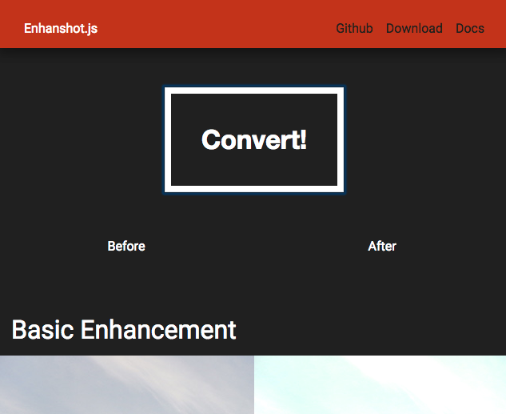

# About

<a href="http://KENJU.github.io/enhanshot"></a>

## What and Why

Enhanshot.js is a javascript library for enhancing images with lightweight and easy way. So far there is only one action for enhancing image, I am going to add many enhance functions as well as Instagram or Tumblr.


## Sample

[Enhanshot.js Sample Page](http://KENJU.github.io/enhanshot)

# Install

## Download ZIP file

Download [ZIP file](https://github.com/KENJU/enhanshot/archive/master.zip) and archive it. The only thing you need is **files in dist folder**.

## Clone Github repository

Or, clone in your local repository.

```bash
$ git clone https://github.com/KENJU/enhanshot.git
$ cd enhanshot
```

## Via Bower

You can also install Enhanshot.js through bower. Simply type below command.

```bash
$ bower install enhanshot
```

# Usage

## 1. Import Script Files

There are three files in [dist](https://github.com/KENJU/enhanshot/tree/master/dist) folder. Download all of them and import.

- jquery.min.js(if you have not yet load jquery in your project)
- enhanshot.min.js
- worker.min.js

```html

<script src="dist/jquery.min.js"></script>
<script src="dist/enhanshot.min.js"></script>

```

You do not have to load `dist/worker.min.js` because enhanshot.min.js load this file.

## 2. Select Effect

Firstly, just add `class="convert-img"` to image tags which you want to enhance.

And then, please add `data-effect="???"` attribute to the same img tag.

```html


```

### Available `data-effect`

#### In the near future
- currently being developped
	- `blur`
	- `mirrorVertical`
	- `mirrorHorizontal`
	- `contrast`

#### v1.0.2 (2015/06/03)
- inherited from previous versions
	- `enhance`
	- `grayscale`
	- `sepia`
- added from this version
	- `negaposi`
	- `opacity`
	- `brighten`
	- `threshold`
	- `hueRotate`
	- `saturate`

#### v1.0.1 (2015/06/02)
- added from this version
	- `enhance`
	- `grayscale`
	- `sepia`

## 3. Call `process(img)` function

### Default

In default, any elements whose id name is `convertBtn` would trigger convert action. Therefore, add `<button>` or `<a>` with id name `converBtn`.

```html

<button id="convertBtn">Convert!</button>	


```

```js

$('#convertBtn').on('click', function(e){
	Array.prototype.forEach.call(document.querySelectorAll('.row-right img'), function(node){
		process(node);
	});
});

```

### Customize

Call `process(img)` function.

```js
var img = $('#convert-target');
process(img);

```

##  Available Effects
### enhance
Basic enhancement for all images from foods, portraits to natures.

#### Usage

```html


```

#### Tech-Background

```js
var red = red * 1.24;
var green = green * 1.33;
var blue = green * 1.21;

```


### grayscale

Make images to grayscale tone. Processing altorhitm is based on NTSC. For the detail please see the [Wiki page about Grayscale, "Luma coding in video systems"](http://en.wikipedia.org/wiki/Grayscale).

#### Usage

```html


```

#### Tech-Background

The human eye is bad at seeing red and blue, so here red and blue color values are de-emphasized.

```js
// calculated from NTSC
var red = red * .29;
var green = green * .58;
var blue = green * .11;

```


### sepia

Make images to sepia tone.

#### Usage

```html


```

#### Tech-Background


```js
var red = red * 1.07;
var green = green * .74;
var blue = green * .43;
```


### Negative-Positive

In negative-positive effect, each rgb values are simply converted.

#### Usage

```html


```

#### Tech-Background

```js
var red = 255 - red_original;
var blue = 255 - blue_original;
var green = 255 - green_original;
```


### Blur
Coming soon...

### Mirror Vertically
Coming soon...

### Mirror Horizontally
Coming soon...

### Opacity
In the default script, alpha value is set to 50%.

#### Usage

```html


```

#### Tech-Background


```js
var alpha = alpha_original * .5;
```


### Brighten

Each rgb values are slighly enhanced.

#### Usage

```html


```

#### Tech-Background


```js
var red += 5;
var blue += 5;
var green += 5;
```


### Threshold

Make each pixels of a image only into black or white.

#### Usage

```html


```

#### Tech-Background

Calculate average value of red, green, blue and then check whether the average value is bigger than threshold value or not.

```js
// threshold
threshold = (r * .29 + g * .58 + b * .11); 
// average value
average = (r + g + b) * .33; 
// black or white
v = (threshold >= average) ? 255 : 0; 
```


### Hue Rotation

Change hue of images.

#### Usage

```html


```

#### Tech-Background

Firstly convert rgb to hsv, and then change hue values, and then re-convert hsv to rgb.


### Saturation

Change saturation of images.

#### Usage

```html


```

#### Tech-Background

Basically the same algorirhum with Hue Rotation.

Firstly convert rgb to hsv, and then change hue values, and then re-convert hsv to rgb.


### Contrast
Coming soon...

# FAQ

### Q. It's HEAVY plugin, ha?
### A. No, Enhanshot.js uses Web Workers API

Usually, some processing about images or photos could be heavy and memory-consuming process, and such heavy plugin could lower the usability of clients sides.

However, thanks to [Web Worker API](https://developer.mozilla.org/ja/docs/Web/API/Worker), a heavy converting process is done under background, therefore it does not cost too much on user experiences.

### Q. How do you do this enhancement process?
### A. In below simple 3 steps
1. Creates empty canvas
2. Processes in worker thread because this process is heavy
3. Draw enhanced canvas onto the image

# Contact

Chekout out my blog, [KJ's Blogging](http://kenju.github.io/blog/), or please contacts me via [twitter](https://twitter.com/kenju_wagatsuma).

# Copyright and License
Code and documentation copyright Kenju Wagatsuma. Code released under [the MIT license](https://github.com/KENJU/enhanshot/blob/master/LICENSE)